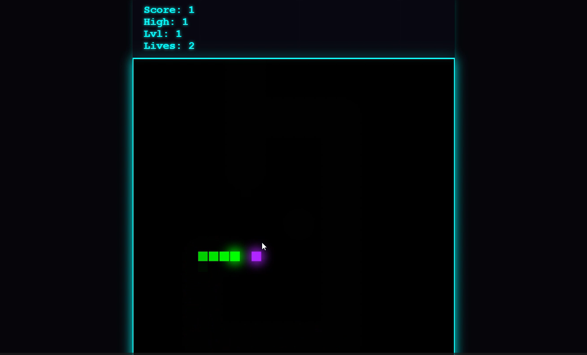
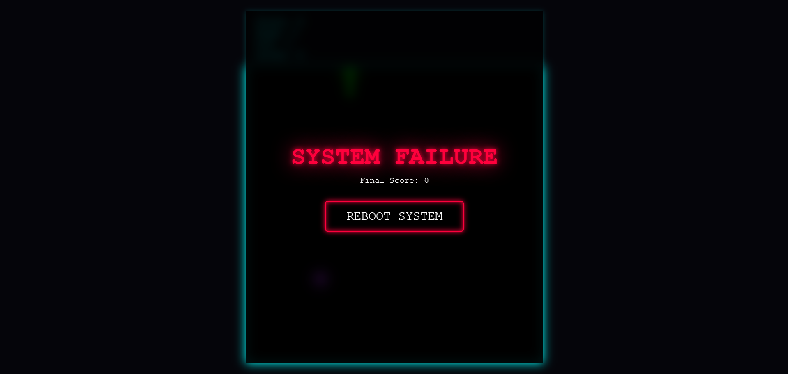
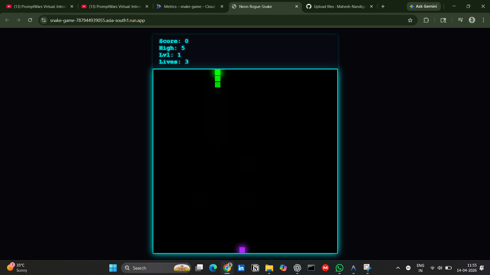

# 🐍 Dynamic Snake Game (Cloud Deployed)

🚀 **Live Demo:** https://snake-game-787944939055.asia-south1.run.app/

## 🔥 About
This is a dynamic Snake Game built using Node.js and deployed on Google Cloud Run.

## ⚡ Features
- Real-time snake movement  
- Wall collision → game over  
- Lives system implemented  
- Sound effects (audio.js)  
- Fully deployed backend  

## 🧠 Tech Stack
- Frontend: HTML, CSS, JavaScript  
- Backend: Node.js  
- Deployment: Google Cloud Run  
- Containerization: Docker  

## 🚀 What I Learned
- Full-stack deployment workflow  
- Docker containerization  
- Cloud Run deployment  
- GitHub version control  

## 📸 Screenshots

### 🎮 Gameplay

  

### 💀 Game Over

  

### 🌐 Live Demo

  

## 🧑‍💻 Contribution Note
This project was built with the help of AI tools for guidance, while I implemented, tested, and deployed the system myself.

